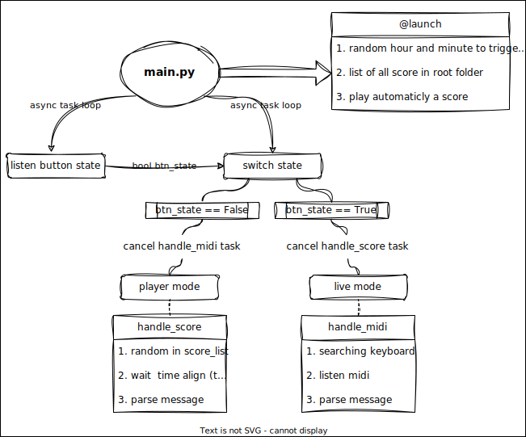
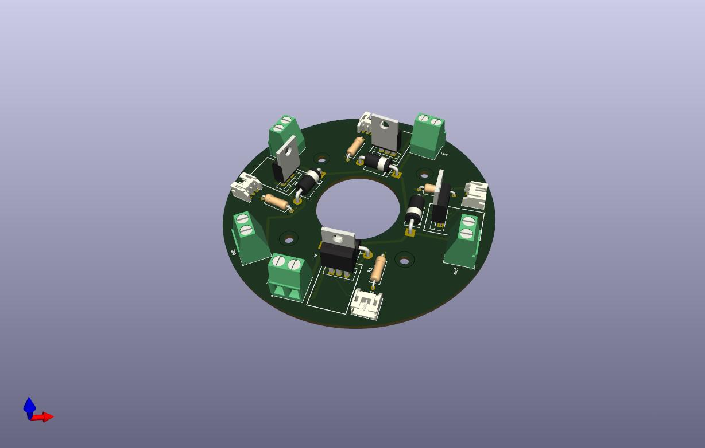
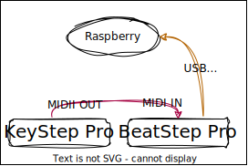

# cloches sous tensions

<!-- TOC -->
- [How it works](#how-it-works)
    - [General hardware diagram](#general-hardware-diagram)
    - [General software diagram](#general-software-diagram)
- [Programm usage](#programm-usage)
    - [Two modes](#two-modes)
    - [Config.yaml](#configyaml)
    - [Class & Functions](#class--functions)
- [Electronic](#electronic)
    - [Components](#components)
    - [PCB layout](#pcb-layout)
    - [Wiring](#wiring)
- [MIDI hardaware](#midi-hardaware)
- [3D Modeling](#3d-modeling)
- [Maintenance, update](#maintenance-update)
- [Hardware limitations](#hardware-limitations)
<!-- /TOC -->

***

This project was born in collab with [Francois Dufeil](https://francoisdufeil.com/) and his sculptural works. 

[IMAGE]

[VIDEO]

It uses a raspberry PCA9685 shield and 16 solenoides ITS-LS3830BD.

Python script runs `@reboot`

## How it works

### General hardware diagram


### General software diagram



## Programm usage

### Two modes

- **live** 
    - activate solenoides with a midi crontoller
    - in `config.yaml` you can set :
        - `message.note`\
            to map the midi note of the controller
        - `message.velocity`\
            it use the velocity to trigg the mosfet
        - record a score. Note that the score is not recorded in .midi but in .txt (cf.[Class & Functions](#class--functions)>**recorder**)
        - `message.control_change`\
            to map the control_change note (cf.[Class & Functions](#class--functions)>**`toggle_drony()`**)
    - for the happening \
    more details : [MIDI hardware](#midi-hardaware)
        - Arturia KeyStep Pro → MIDI out
        - MIDI in → Arturia BeatStep Pro
    - do not care about `message.channel` or `message.time`
- **auto**
    - read a score at the boot (cf.[Class & Functions](#class--functions)>**utils**>**`draw_lottery()`** and **`many_lottery()`**)
    - in `config.yaml` `date` where can set the range and the number of `draw_lottery()` defines in `utils.py`
    - when auto mode is triggered, `handle_score()` will read at once a score. After the `first_playing_score` is set to False and the function wait `now() == target()` to read the next score store in table_draw
    - `table_draw` is define with the `utils.many_draw(x)` function where x is the number of auto will be triggered

### Config.yaml

|-|-|
|--|--|
|**controller**|simply the name of the controller. You can use `available_ports()` function in `utils.py` to get the exacte name.|
|**date**|usefull to set the range of hours to trigger the automation, the number of time of activation|
|**signal**|define the range of value (7bits for midi input and 16bits for PWM signal) and sommes default value when drony is triggered|
|**PWM**|settings for the PCA9685 shield|
|**mapping**|collection of midi notes and control_change to map the PWM channel of the PCA9685|
|**machine**|specifications of the machine (motors, btn_pin, led_pin) AND the `travel_time` table wich defines the `hit_length` of solenoides depending of the `message.velocity`|

### Class & Functions

- **sol{}**\
Class\
It's base on async to let the motor the time to reach the contact point with the bells.
|--|--|
|**tape()**|It automaticly set the travel_time `self.hit_length` by searching in the config.yaml at machine->motors->travel_time| 
|**toggle_drony()**|When call, it create an async task `self.drony()` or cancels it if `self.dronying` is True. It free some bandwith for the midi signal and you can set the time between two tapes with the `midi.control_change.value` into the `stream_potard()`|
|**drony()**|**Do not call by itself**. The security heat setting is comments, ad the frequency calculator. the `self.delai_off` is set with the `self.stream_potar()` function|
|**get_timer()**|It uses by security settings as well as frequency calculator|

- **recorder{}**\
Class
|--|--|
|**get_current_millis()**|the recorder needs to know the duration between two midi note. Only 1ms definition|
|**write()** and **record()**|realy simple and automated. You can call the `rec.record_score()` in each loop, it will record as the `rec.record_status == True` and stop when is False.|

You can take a look at the `handle_score()` in `main.py` or `recorder.py`.

This is a sample of recorder looks like :
```
450
note_on channel=0 note=67 velocity=40 time=0
106
note_off channel=0 note=67 velocity=64 time=0
387
note_on channel=0 note=68 velocity=100 time=0
```
- **player{}**\
Class
|--|--|
|**read_file()**|load a score in `self.raws`|
|**parse_midi_string()**|use the mido `Message()` function to return the line's score into a midi message|

The `handle_score()` in `main.py` parse the file line by line to consider odds line with the delay between to midi messages.

- **utils[]**\
Collection of functions
|--|--|
|**pca**|Usefull to use the driver just by calling `utils.pca.*<any_functions>*`|
|**draw_lottery()** and **many_lottery()**|Theses functions read how many `.txt` are in the root folder to set the table_draw list|
|**reset_all_pwn()**|Pretty secure to avoid any locked in solenoide at every boot|
|available_ports()|You can know the exacte name of your midi controller|
|**connecting_controller()**|Async function to let user switch the machine state before or after the keyboard pluged|

## Electronic

### Components

- RaspberryPi 4 with a [PCA9685 shield](https://www.waveshare.com/wiki/Fan_HAT)\
I only use it for the PCA9685 chip controlled I2C
    - installation
    ```
    sudo apt update && sudo apt upgrade
    sudo apt install python3-pip python3-smbus
    sudo pip install RPi.GPIO
    ```
- [Button](https://www.gotronic.fr/art-bouton-poussoir-ip67-bt22b-l-v-34105.htm) to switch live/auto mode
- [Emergency stop button](https://www.amazon.fr/gp/product/B097B8S6XL/ref=ox_sc_act_title_1?smid=A066248065M1IW1TJ2D&psc=1) connect only on the 48Volt power supply
- 12V and 48V power supply. 12V for the Raspberry and 48V (we chose 420W) for the solenoides.

### PCB layout

You can find the KiCad projet, .svg and .step in `pcb_design/_src` folder. I chose the irl540 mosfet to design the regulator. 

- Schem


- Layout



### Wiring

- 16 pwm output from the pca9685 shield on the irl540 pcb with the common rapsberry and shield GND
- button\
you can find all in `config.yaml`:`machine`
    - GPIO27 : pullup pin
    - GPIO17 : led pin
    - the GND is common


## MIDI hardaware

- [BeatStep Pro](https://www.arturia.com/fr/products/hybrid-synths/beatstep-pro/resources) made by Arturia. This is the master keyboard connected to the Raspberry Pi. You can download the Midi Control Center to map all the keys and match it in `config.yaml`.
- [KeyStop Pro](https://www.arturia.com/fr/products/hybrid-synths/keystep-pro/resources) made by Arturia. We use it to send midi notes and play with all the features — record sequences, arpeggiators, pattern, scaling, arranging... — This keyboard is really easy to use and very versatil.



## 3D Modeling

You can find some parts that we use to properly mount the brain inside the box.


## Maintenance, update

For the software maintenance and modify some scores the raspberry is connected to my VPN so I have ssh access to modify, reboot, update, upgrade...

## Hardware limitations

- Because MIDI send 7bits values and the PCA9685 use 16bits value, consider to use the `utils.convert()` function.
- `['machine']` section in the `config.yaml`
    - *btn_pin* and *led_pin* to set a visual indication switch *live<->auto* mode
    - *travel_time*\
    the solenoide needs time to reach the bells's contact point. This travel time (named `hit_length` sometimes in the code) is define by the PWM value sended (`message.velocity`).\
    The formula `int((1100*(pow(3.14,(-0.055*p))))+23)` suppose to give the best result where `p` is the `message.velocity` but I failed to implement it correctly because of latency issues.\
    So the travel_time manages a manuel mapping with the `utils.find_index()` and the `travel_time` table in `config.yaml`
- solenoide
    - security setting `max_dronying` exist but i finaly disable it in the exhibition version cause i did not notice too much heat during tests phase of the prototype. In addition sometimes it produces an axe drifting effect that is pretty satisfying and creates some cool patterns wich are not possible with the setting enable and the frequency of hit drasticly improve with `self.d.off`<15ms

